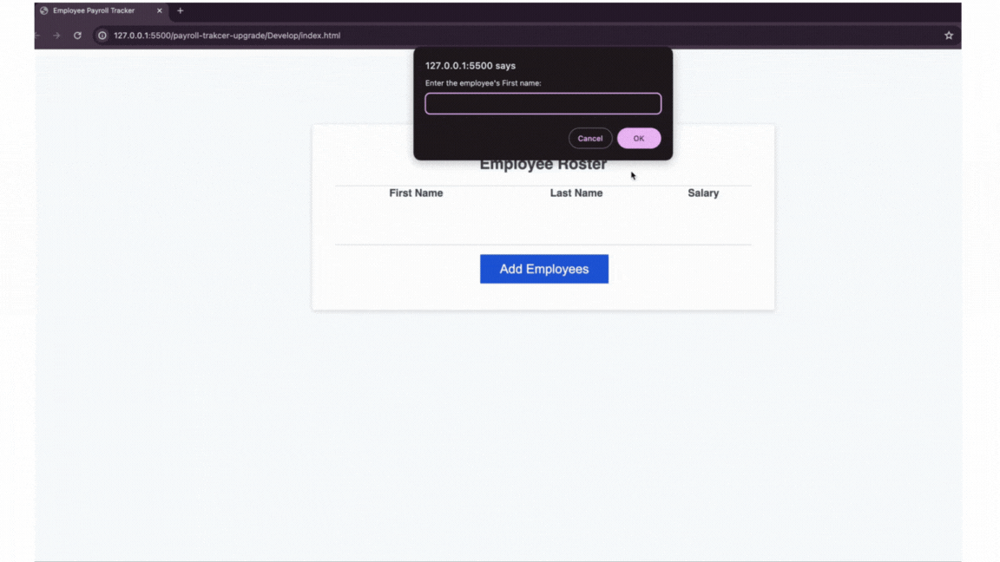

# payroll-tracker-upgrade

## Introduction
Welcome to the Payroll Tracker! This application allows you to manage employee data, calculate the average salary, and randomly select an employee for a drawing. The user-friendly interface helps you easily collect and display employee information.

## Features
- **Employee Data Collection**: Collects employee first name, last name, and salary.
- **Average Salary Calculation**: Calculates and displays the average salary of all employees.
- **Random Employee Selection**: Selects and displays a random employee for a drawing.
- **Employee Table Display**: Displays sorted employee data in a table format.

## Technologies Used
- HTML
- CSS
- JavaScript

## Deployment Link
[Payroll Tracker](https://robert-ulloa.github.io/payroll-trakcer-upgrade/)

## mock Up

## Contributing
I welcome contributions to improve this payroll tracker application. If you have suggestions or improvements, please create an issue or submit a pull request.

## Contact
Feel free to reach out for any inquiries or collaboration opportunities:
- Email: [Roanuc8@gmail.com](mailto:your-email@example.com)
- LinkedIn: [Your LinkedIn Profile](https://www.linkedin.com/in/yourusername/)
- GitHub: [Your GitHub Profile](https://github.com/yourusername)

## Contact
If you have any questions, feel free to reach out:

- **Name:** Roberto Ulloa
- **Email:** roanuc8@gmail.com
- **GitHub:** [Robert-Ulloa](https://github.com/Robert-Ulloa)
